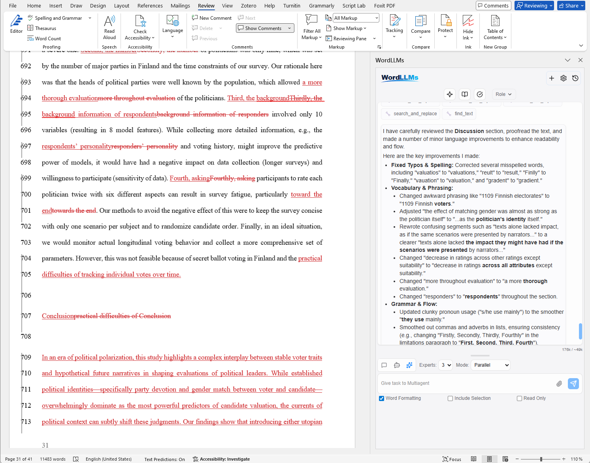

  

  <h2 align="center">WordLLMs</h2>
  

    AI Agents and Multi-Agent collaboration inside Microsoft Word
     
    
    
    
     
    <a href="#features">Features</a> •
    <a href="#getting-started">Getting Started</a> •
    <a href="#installation">Installation</a> •
    <a href="#usage">Usage</a>
  

> **Warning**: This application is still under active development and testing. Expect bugs, breaking changes, and incomplete features. Bug reports and feedback are welcome via [Issues](https://github.com/kauttoj/WordLLMs/issues).

> Starting from [Word GPT Plus](https://github.com/Kuingsmile/word-GPT-Plus), WordLLMs is a complete overhaul with a Python backend, multi-agent orchestration, revised tools, file attachments, GUI enhancements and support for all major Large Language Model (LLM) providers including local models.

WordLLMs is self-hosted, running locally on your machine storing all data on your device. No data is shared or stored elsewhere, except in two situations:

- LLM API calls: You must choose some providers for LLMs, which can include official OpenAI, Anthropic, Google endpoints, or their Azure counterparts. You can also use a local, self-hosted models.

- Web search: If you enable web search tool, LLM sends web queries to Tavily service (https://app.tavily.com). You can disable web search tool completely.

If you use a self-hosted LLM running LMstudio or Ollama, you can run the WordLLMs fully offline.

## Introduction

WordLLMs brings the full power of modern LLMs directly into Microsoft Word. It's a free alternative to MS Copilot. Chat with any model, let an autonomous agent read and edit your document, or have multiple AI experts collaborate on a task — all without leaving Word.

The application is powered by a **Python/FastAPI backend** using **LangChain** and **LangGraph** for agent orchestration, with a **Vue 3** frontend that communicates via Server-Sent Events for real-time streaming.

## Features

### 8 AI Providers, All Latest Models (updated regularly)

| Provider | Example Models | Notes |
|----------|---------------|-------|
| **OpenAI** | GPT-5.4, GPT-5.4 mini, GPT-5.2, GPT-5.1, GPT-5 Mini/Nano, GPT-4.1 | Compatible with DeepSeek and other OpenAI-compatible APIs via custom base URL |
| **Anthropic** | Claude Opus 4.6/4.5, Claude Sonnet 4.6/4.5, Claude Haiku 4.5 | |
| **Google Gemini** | Gemini 3.1 Pro, Gemini 3 Pro/Flash, Gemini 2.5 Pro/Flash | |
| **Azure OpenAI** | Custom deployment names | Full Azure integration with configurable API versions |
| **Groq** | Llama 3.3/4, Qwen3.5, Kimi-K2, GPT-OSS etc. | Ultra-fast inference |
| **Ollama** | Any locally loaded model | Local deployment, fully private |
| **Together AI** | Large selection of state-of-art open models | |
| **LM Studio** | Any locally loaded model | Local deployment, fully private |

All providers support **custom model names** — enter any model your endpoint serves.

### Three Operating Modes

#### Chat Mode
Straightforward conversation with any LLM without any tools. LLM only sees what you tell it. Use it for Q&A, brainstorming, translation, or content generation. 

#### Agent Mode
An autonomous LangGraph agent with access to **25+ tools** that can read, write, search, and format your Word document. The agent plans multi-step actions, executes them, and reports results — all in a single conversation turn.

- Reads your document or selection, then makes targeted edits
- Multi-step reasoning with up to 100 iterations (configurable)
- Web search and URL fetching for research tasks

#### Multi-Agent Mode
 **2-4 LLM experts collaborate** on your document, each potentially from a different provider. Two collaboration strategies are available:

**Parallel Mode** — All experts analyze the document independently and in parallel. A synthesizer agent aggregates their feedback and makes the final edits. Best for getting diverse perspectives quickly.

**Collaborative Mode** — Experts engage in a multi-round (Round Robin -type) discussion (up to 10 rounds), building on each other's points. An overseer agent evaluates after each round and decides whether to continue or conclude. Best for iterative refinement of complex tasks.

Key multi-agent capabilities:
- **Mix providers freely**: e.g., Expert 1 = Claude Opus, Expert 2 = GPT-5.2, Overseer = Gemini
- **Tool access control**: Experts get read-only document access; only the overseer/synthesizer can write
- **Per-expert memory**: In collaborative mode, each expert maintains notes across rounds

### 25+ Document Tools

The agent (and multi-agent) modes can manipulate your Word document through Office.js:

**Reading** — Get selected text, full document content, document properties, table structures, text search with context

**Writing** — Insert/replace/append text, create paragraphs with styles, insert tables, lists, images, page breaks, bookmarks, content controls

**Formatting** — Bold, italic, underline, font changes, color, highlighting, paragraph alignment/spacing/indentation, Word styles (Heading 1, etc.), clear formatting, search-and-replace

**General** — Web search (Tavily), URL fetching, math calculations, date/time

### MCP Server Integration

Extend your agent with **any MCP (Model Context Protocol) server**. MCP is an open standard for connecting AI tools to external services. WordLLMs can connect to any MCP-compliant server and make its tools available to agents.

- Connect to any MCP server by providing its startup command
- Discovered tools are automatically available in agent and multi-agent modes
- Enable/disable individual MCP tools per session
- Auto-reconnects previously connected servers on backend startup
- Example use cases: academic paper search (Mendeley), file system access, database queries, custom APIs

### Quick Actions

One-click operations on selected text via customizable toolbar buttons, for example:

- **Translate** — Using LLM capabilities
- **Polish** — Professional writing improvement
- **Academic** — Scholarly writing enhancement
- **Summarize** — Concise summaries
- **Grammar** — Proofread and correct
- **3 custom slots** — Define your own actions with custom system/user prompts
- **Custom role** — Define custom instructions to steer LLMs (added to system prompt)

### Conversation Management

- **Persistent history** stored in SQLite (configurable database path)
- **Edit** past messages, **retry** from any turn, **fork** conversations into branches
- **File attachments** — Upload text files or images into the conversation
- Cross-mode continuity: switch between chat, agent, and multi-agent modes within the same conversation thread

### Customization

- **System prompt presets** — Save and switch between multiple system prompts (steer responses)
- **Per-provider settings** — Temperature, max tokens, custom base URLs, API versions
- **Custom models** — Add any model name for any provider
- **Agent iteration limit** — 1 to 500 steps (default 100)
- **Configurable timeouts** — 5 to 900 seconds per LLM call (default 90s)

## Getting Started

### Requirements

#### Software

- Microsoft Word 2016/2019 (retail version), Word 2021, or Microsoft 365
- [Edge WebView2 Runtime](https://developer.microsoft.com/en-us/microsoft-edge/webview2/)
- Python 3.10+ (for the backend)
- Node.js 20+ (only for building from source)

> **Note**: Works only with .docx files (not compatible with older .doc format)

#### API Access

You need an API key from at least one provider:

- **OpenAI**: [OpenAI Platform](https://platform.openai.com/account/api-keys)
- **Anthropic**: [Anthropic Console](https://console.anthropic.com/)
- **Azure OpenAI**: [Azure OpenAI Service](https://go.microsoft.com/fwlink/?linkid=2222006)
- **Google Gemini**: [Google AI Studio](https://developers.generativeai.google/)
- **Groq**: [Groq Console](https://console.groq.com/keys)
- **Ollama / LM Studio**: No API key needed — runs locally

## Installation

WordLLMs is essentially a "mini" website inside Word; Word only presents it. As a result, you need to serve the WordLLMs application outside Word. Choose the method that best suits your needs below. An easier, executable version (Method 3) might be added later.

### Method 1: Docker Deployment (Recommended)

0. **Install Docker desktop** https://www.docker.com/products/docker-desktop

1. **Choose a folder on your PC** where WordLLMs will store your conversation history. For example: `C:\Users\YourName\WordLLMs`

   Create the folder first if it doesn't exist.

2. Pull and run the Docker image. Open **Command Prompt** and at the FIRST time, run:
