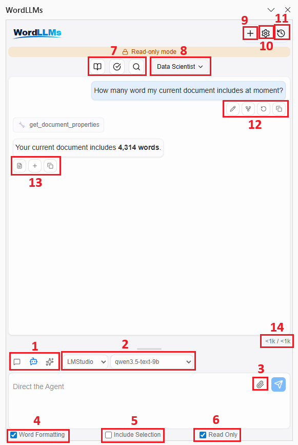
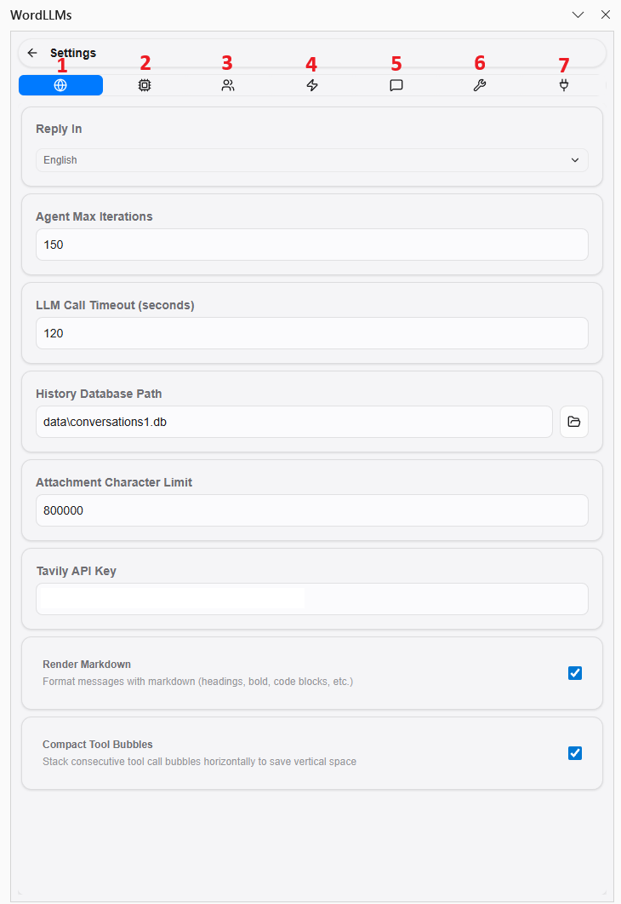

# WordLLMs — Usage Guide

WordLLMs is an AI assistant that lives inside Microsoft Word. It lets you chat with AI, ask questions about your document, have the AI write and edit for you, and even coordinate multiple AI experts on complex tasks — all without leaving Word.

---

## Table of Contents

1. [The Main Window](#1-the-main-window)
2. [Choosing a Mode: Ask, Agent, or MultiAgent](#2-choosing-a-mode-ask-agent-or-multiagent)
3. [Setting Up Your AI Provider](#3-setting-up-your-ai-provider)
4. [Chatting with the AI](#4-chatting-with-the-ai)
5. [Quick Actions — One-Click Shortcuts](#5-quick-actions--one-click-shortcuts)
6. [Role Prompts (System Prompts)](#6-role-prompts-system-prompts)
7. [Key Checkboxes: Word Formatting, Include Selection, Read Only](#7-key-checkboxes-word-formatting-include-selection-read-only)
8. [Agent Mode — The AI Works in Your Document](#8-agent-mode--the-ai-works-in-your-document)
9. [MultiAgent Mode — A Team of AI Experts](#9-multiagent-mode--a-team-of-ai-experts)
10. [Managing Conversations](#10-managing-conversations)
11. [Settings Reference](#11-settings-reference)
12. [Tips & Best Practices](#12-tips--best-practices)

---

## 1. The Main Window

When you open the WordLLMs pane, you will see a chat interface. The figure below shows all the key components with numbered labels.

| # | Component | Description |
|---|-----------|-------------|
| 1 | **Mode buttons** | Switch between Ask, Agent, and MultiAgent modes. See [Section 2](#2-choosing-a-mode-ask-agent-or-multiagent). |
| 2 | **Provider & model selectors** | Choose which AI service and model to use. Hidden in MultiAgent mode (configured in Settings instead). |
| 3 | **Attach & Send buttons** | Paperclip opens the file picker to attach documents or images. Blue arrow sends your message. |
| 4 | **Word Formatting** | When checked, the AI uses proper Word styles (headings, bullets, etc.) in its response. |
| 5 | **Include Selection** | When checked, your current text selection in Word is automatically sent with every message. |
| 6 | **Read Only** | Restricts the agent to reading the document only — no edits allowed. Safe for exploration. |
| 7 | **Quick Action buttons** | One-click prompt shortcuts (Translate, Polish, Grammar, etc.). See [Section 5](#5-quick-actions--one-click-shortcuts). |
| 8 | **System Prompt dropdown** | Select an active role/persona for the AI (e.g. "Data Scientist"). See [Section 6](#6-role-prompts-system-prompts). |
| 9 | **New Chat** | Start a fresh conversation. The previous one is saved in History. |
| 10 | **Settings** | Open the full settings panel. |
| 11 | **History** | Browse and restore previous conversations. |
| 12 | **User message actions** | Hover over your message to reveal: Edit (pencil), Fork (branch), Retry (arrow), Copy. |
| 13 | **AI response actions** | Hover over an AI response to reveal: Replace selection in Word, Insert at cursor, Copy to clipboard. |
| 14 | **Context counter** | Shows how many characters/tokens the current conversation uses. |

The **Read-only mode banner** (the orange bar visible at the top of the conversation area) appears whenever Read Only mode is active, so you always know the agent cannot make changes.

---

## 2. Choosing a Mode: Ask, Agent, or MultiAgent

Three mode buttons sit at the top of the input area. The mode you pick determines what the AI is allowed to do.

### Ask Mode
The simplest mode. The AI answers your questions and has a conversation with you. It does **not** interact with your Word document at all. Think of it like a smart chat window inside Word.

**Good for:** Brainstorming ideas, asking questions, getting explanations, drafting text to copy manually.

### Agent Mode
The AI becomes an active assistant that can **read and edit your document** and use tools like web search. It works step-by-step: it thinks about your request, uses tools as needed (you can see each step), and delivers a final answer or performs the edits directly.

**Good for:** "Write a conclusion for this paper", "Fix the formatting in this section", "Search the web and summarize the top results into my document", "Replace all instances of X with Y".

### MultiAgent Mode
Instead of one AI, you deploy a team of AI experts (1–4) who each work on your task, then combine their insights. There are two collaboration styles:

- **Parallel**: All experts work independently at the same time, then a synthesizer combines their answers. Fastest option.
- **Collaborative**: Experts discuss and build on each other's work across several rounds, with an overseer directing them. Best for nuanced, complex tasks.

**Good for:** In-depth research, getting multiple perspectives, complex writing tasks that benefit from structured debate.

---

## 3. Setting Up Your AI Provider

WordLLMs supports many AI providers. Before you can chat, you need to configure at least one.

1. Click the **Gear** icon to open Settings.
2. Go to the **API Provider** tab.
3. Select your provider (OpenAI, Anthropic, Google Gemini, Groq, Azure, Ollama, LMStudio, or TogetherAI).
4. Enter your **API Key** (for cloud providers) or **endpoint URL** (for local providers like Ollama or LMStudio).
5. Choose a **model** from the dropdown, or type a custom model name.
6. Close Settings. On the main page, confirm your provider and model are selected in the dropdowns below the mode buttons.

**Temperature** controls how creative vs. precise the AI is. A value near 0 gives focused, deterministic answers. A value near 1–2 gives more varied, creative responses. The default (1.0) works well for most tasks.

---

## 4. Chatting with the AI

### Sending a Message
Type your message in the text box and press **Enter** or click the blue **Send** button. To add a line break without sending, press **Shift+Enter**.

### Attaching Files
Click the **paperclip** icon to attach files to your message. The AI will read their contents and use them in its response. Supported types include documents (.txt, .pdf, .docx), spreadsheets (.csv, .xlsx), code files, images, and many more — over 40 formats in total.

### Including Your Selected Text
Check the **Include Selection** box (see Section 7) to automatically send whatever text you have highlighted in Word along with your message.

### What You Can Do with AI Responses
Each AI response has action buttons that appear when you hover over it:
- **Copy** — Copy the response to clipboard
- **Insert into document** — Insert the response at your current cursor position in Word
- **Append to document** — Add the response to the end of your document

Your own messages also have action buttons:
- **Edit** — Modify a previous message and re-run from that point
- **Fork** — Branch the conversation from this message to explore a different direction
- **Retry** — Re-send the last message to get a fresh response

### Stopping a Response
Click the red **Stop** button (square icon) to cancel an ongoing response at any time.

---

## 5. Quick Actions — One-Click Shortcuts

Quick Actions are preset prompt buttons displayed above the input box. They let you apply a common AI transformation to your text in one click.

**Default Quick Actions:**
- **Translate** — Translate selected text to your configured reply language
- **Polish** — Improve the writing style and clarity of selected text
- **Academic** — Rewrite selected text in formal academic language
- **Summary** — Create a concise summary of selected text
- **Grammar** — Fix grammatical errors in selected text

**How to use them:**
1. Select some text in your Word document (or leave nothing selected if the action doesn't require it).
2. Click a Quick Action button.
3. The AI processes your text using that preset prompt and returns the result.

**Customizing Quick Actions:**
Go to **Settings → Quick Actions**. You have 8 customizable slots. For each slot you can set:
- A **name** (shown on the button)
- A **prompt** (what gets sent to the AI — you can use `${language}` as a placeholder for your configured reply language)
- An **icon** (choose from 10 icon options)
- **Enable/disable** the slot

---

## 6. Role Prompts (System Prompts)

A Role Prompt (also called a System Prompt) gives the AI a persistent persona or set of instructions that apply to the entire conversation. It shapes how the AI behaves — its tone, expertise, priorities.

**Built-in presets:**
- **Data Scientist** — Analytical, evidence-based, quantitative thinking
- **Academic Writer** — Scholarly tone
- **Marketing Assistant** — Persuasive, audience-focused copy

**How to use:**
On the main page, look for the system prompt dropdown (near the input area). Select a preset to activate it. The AI will follow its instructions throughout your conversation.

**Creating your own:**
Go to **Settings → System Prompts**. Click **Add** to create a new preset, give it a name, and write your instructions. For example: "You are a legal document reviewer. Always flag ambiguous language and suggest clearer alternatives."

To stop using a role prompt, deselect it in the dropdown.

---

## 7. Key Checkboxes: Word Formatting, Include Selection, Read Only

Three checkboxes sit below the text input. They are small but important.

### Word Formatting
When checked, the AI is instructed to use proper Word document styles in its responses — headings, bullet points, bold text, and so on — rather than plain prose. This is especially useful when you want the AI to write directly into your document and have it look well-formatted.

### Include Selection
When checked, whatever text you have currently selected in your Word document is automatically included with every message you send. This is a powerful shortcut: select a paragraph, check this box, and every message will reference that text without you having to copy-paste it.

Example: Select a paragraph you want to improve, check Include Selection, then type "Make this more concise." The AI sees the paragraph and rewrites it.

### Read Only
Available in Agent and MultiAgent modes. When checked, the agent is restricted to **reading** your document — it cannot make any changes. Use this when you want the agent to analyze or summarize your document without risk of accidental edits.

---

## 8. Agent Mode — The AI Works in Your Document

In Agent Mode, the AI has access to a set of tools it can call to interact with your document and the web. You can watch it work: each tool call appears as a collapsible bubble in the conversation, showing what the agent did.

### What the Agent Can Do

**Reading your document:**
- Read the full document text or just your current selection
- Get document statistics (word count, paragraph count, etc.)
- Find specific text in the document
- Read table contents and formatting details

**Writing and inserting content:**
- Insert text at the cursor position
- Append text to the end of the document
- Insert new paragraphs with optional heading styles
- Insert tables (you specify rows and columns)
- Insert bulleted or numbered lists
- Insert images from a URL
- Insert comments on selected text

**Editing and formatting:**
- Replace selected text with new content
- Find and replace text across the whole document (or within a selection)
- Apply formatting: bold, italic, underline, font, size, color, highlight
- Apply built-in Word styles (Heading 1, Heading 2, Title, Quote, etc.)
- Clear all formatting from selected text
- Adjust paragraph settings: alignment, spacing, indentation

**Navigation and bookmarks:**
- Select text between two anchor phrases
- Jump to a named bookmark
- Insert bookmarks

**Web and utility tools:**
- Search the web (DuckDuckGo)
- Fetch and read the content of a web page
- Perform math calculations
- Get the current date and time

### Controlling Which Tools Are Available
Go to **Settings → Tools** to enable or disable individual tools. For example, if you want the agent to only use web tools and never touch the document, you can disable all Word tools.

### Agent Iteration Limit
By default, the agent can take up to 25 steps (tool calls) per task. You can adjust this in **Settings → General → Agent Max Iterations**. Complex tasks may need more steps; simple tasks need fewer.

---

## 9. MultiAgent Mode — A Team of AI Experts

MultiAgent Mode lets you create a team of AI experts, each potentially using a different model or provider, to collaborate on your task.

### Setting Up Experts
When MultiAgent mode is selected, two controls appear:
- **Number of experts** (1–4) — How many experts work on the task
- **Mode** — Parallel or Collaborative

Each expert's model and settings are configured in **Settings → Multi-Agent**. You can assign them different AI models. For example:
- Expert 1: GPT-5.4 
- Expert 2: Claude Opus 4.6 
- Expert 3: Gemini 3.1 Pro

### Parallel Mode
All experts receive your task simultaneously and work independently. Once all are done, a **synthesizer** agent reads all their responses and combines them into one final answer. This is the fastest option and works well when you want diverse perspectives merged together.

### Collaborative Mode
Experts share their responses with each other across multiple rounds of discussion. An **overseer** evaluates progress after each round and decides whether to continue or conclude. This produces more refined, consensus-driven results but takes more time. You can control the maximum number of rounds in **Settings → Multi-Agent → Max Rounds**.

### Expert Full History
In **Settings → Multi-Agent**, you can enable **Expert Full History**. When on, experts can see the full prior conversation context, giving them more background for their work. When off, experts only see the current task.

> **Cost warning:** MultiAgent mode multiplies your token usage. Each expert processes the full task independently, and in Collaborative mode this repeats across multiple rounds. A 4-expert collaborative run with 3 rounds and a long document can easily consume 10–20x the tokens of a single chat message. Similarly, Agent mode on large documents accumulates tokens with every tool call and intermediate step. If you are using a paid API, keep an eye on the context counter (component 14 in the main window figure) and consider reducing expert count, max rounds, or document size when cost matters.

---

## 10. Managing Conversations

### Starting Fresh
Click the **+** button in the top bar to start a new conversation. This clears the current chat but does not delete it — you can find it in the history.

### Browsing History
Click the **clock** icon in the top bar to open the conversation history. You can browse all past sessions and click one to restore it. The full message history will be loaded back.

### Forking a Conversation
To explore a different direction from a past point in the conversation, hover over a message and click the **fork** icon. This creates a new branch from that message, leaving the original untouched.

### Editing Past Messages
Hover over one of your past messages and click the **pencil** icon to edit it. The conversation will re-run from that point with your updated message.

---

## 11. Settings Reference

Open Settings by clicking the gear icon. The settings panel has 7 tabs along the top, shown in the figure below.

| # | Tab | What it controls |
|---|-----|-----------------|
| 1 | **General** | Reply language, agent iteration limit, LLM call timeout, history database path, attachment character limit, Tavily API key, markdown rendering, compact tool bubbles |
| 2 | **API Provider** | API keys, base URLs, model selection, custom models, temperature, and context window size for each provider (OpenAI, Anthropic, Azure, Gemini, Groq, Ollama, LMStudio, TogetherAI) |
| 3 | **Multi-Agent** | Expert names and models, overseer/synthesizer model, max rounds, expert parallelization, and full history options |
| 4 | **Quick Actions** | Customize the 8 one-click prompt buttons (name, prompt text, icon, enable/disable) |
| 5 | **System Prompts** | Create and manage role/persona presets to steer the AI's behavior across a session |
| 6 | **Tools** | Enable or disable individual Word document tools and general tools available to the agent |
| 7 | **MCP Servers** | Connect external Model Context Protocol servers to extend the agent with additional tools |

### General Settings Explained
- **UI Language** — The language of the interface itself
- **Reply Language** — The language the AI responds in (used by Quick Actions with `${language}`)
- **Agent Max Iterations** — Maximum number of tool calls per agent task (default: 25)
- **LLM Call Timeout** — How long to wait before cancelling a slow AI response (default: 90 seconds)
- **Render Markdown** — When on, AI responses render with formatted text (bold, headings, etc.); when off, shows raw text
- **Compact Tool Bubbles** — Stacks consecutive tool call steps side-by-side to save vertical space

---

## 12. Tips & Best Practices

**Choosing the right mode:**
- Use **Ask** for general questions, brainstorming, or when you just want to talk to the AI.
- Use **Agent** when you want the AI to actually work on your document — read it, write to it, or research something.
- Use **MultiAgent** for complex, important tasks where you benefit from multiple perspectives or a more thorough analysis.

**Getting better results:**
- Be specific in your requests. "Rewrite the second paragraph to be more concise and formal" works better than "make it better."
- Select the relevant text before clicking a Quick Action or sending a message with Include Selection enabled.
- If the agent makes an unintended edit, use Word's Ctrl+Z to undo it — Word's own undo history still works.

**Staying safe with Agent mode:**
- Enable **Read Only** mode when you want the AI to analyze your document without risk of changes.
- You can disable specific tools in **Settings → Tools** if you want to restrict what the agent is allowed to do.
- You can also lower the **Agent Max Iterations** to prevent the agent from taking too many steps on a single task.

**Working with long documents:**
- The AI can only read as much text as fits in its context window. For very long documents, be specific about which section you want it to work on, or use "Include Selection" with only the relevant portion selected.
- The context window size is configurable per provider in **Settings → API Provider**.

**Using file attachments:**
- You can attach reference documents, data files, or code files to give the AI more context.
- Images are supported — you can attach a screenshot or diagram and ask the AI to describe or analyze it.
- Attachments persist for the entire conversation session.

**Choosing the right model:**
- Small open-source models (roughly below 25B parameters — common with Ollama, LMStudio, or TogetherAI) often struggle with document editing tasks. They tend to get stuck in endless loops, repeatedly tweaking styles, paragraph spacing, or minor formatting details without making real progress. This is a known limitation of smaller models. If you use them, limit the available tools in **Settings → Tools** (disable formatting-heavy tools) and avoid giving them complex multi-step editing tasks. They work better for simple Q&A or text generation in Ask mode.
- When entering a custom model name (for Azure, LMStudio, TogetherAI, or any provider with a custom model field), make sure the name is exactly as listed in the provider's model catalogue or your deployment configuration. Even a small typo will cause the request to fail. For Azure, this is your deployment name; for LMStudio/Ollama, it is the model identifier shown in the app.
